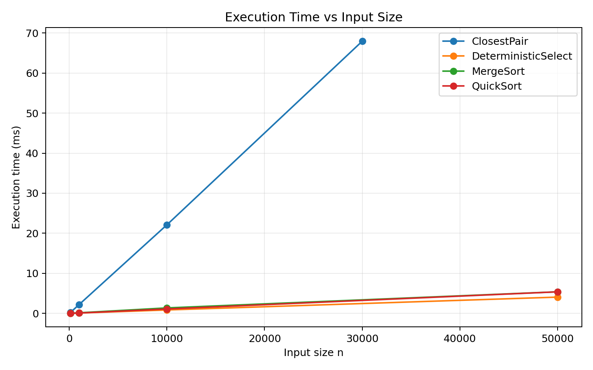
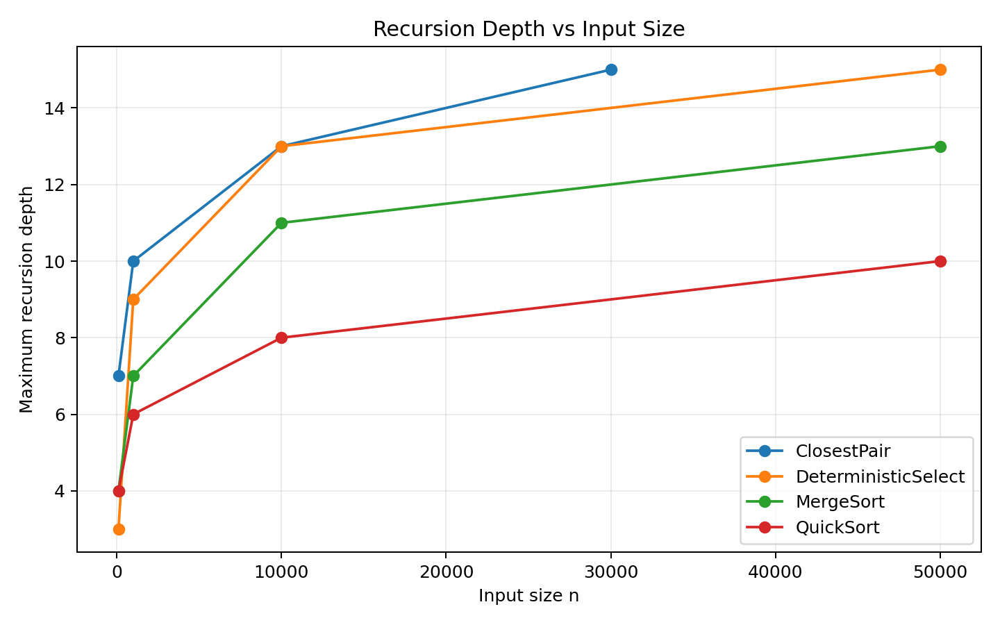
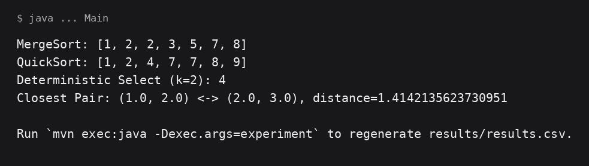
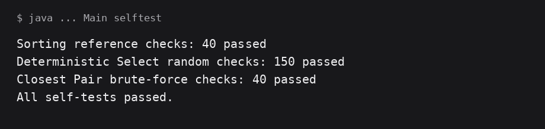
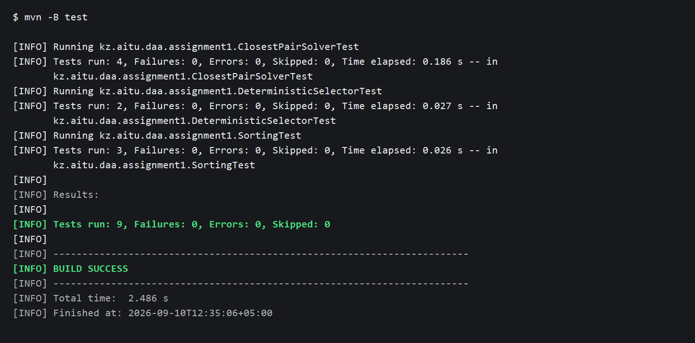

# Assignment 1: Divide-and-Conquer Algorithm Analysis

**Student:** Maussymzhan Makazhan

**Group:** SE-2527

## Project Overview

This project implements and analyzes four classic divide-and-conquer algorithms in Java:

- MergeSort
- Randomized QuickSort
- Deterministic Select (Median of Medians)
- Closest Pair of Points

The goal is not only to produce correct answers, but also to connect the implementation with recurrence relations, asymptotic complexity, recursion depth, and measured execution time.

## Project Structure

```text
assignment1-divide-and-conquer/
├── .github/workflows/ci.yml
├── src/
│   ├── main/java/kz/aitu/daa/assignment1/
│   │   ├── AlgorithmMetrics.java
│   │   ├── MergeSorter.java
│   │   ├── QuickSorter.java
│   │   ├── DeterministicSelector.java
│   │   ├── ClosestPairSolver.java
│   │   ├── Point.java
│   │   ├── Experiment.java
│   │   ├── SelfTest.java
│   │   └── Main.java
│   └── test/java/kz/aitu/daa/assignment1/
│       ├── SortingTest.java
│       ├── DeterministicSelectorTest.java
│       └── ClosestPairSolverTest.java
├── docs/
│   ├── plots/
│   │   ├── time_vs_n.png
│   │   └── recursion_depth_vs_n.png
│   └── screenshots/
├── results/results.csv
├── scripts/plot_results.py
├── pom.xml
└── README.md
```

## How to Run

Requirements: Java 17+ and Maven.

```bash
mvn test
mvn exec:java
mvn exec:java -Dexec.args=selftest
mvn exec:java -Dexec.args=experiment
python scripts/plot_results.py
```

`experiment` regenerates `results/results.csv`. The Python script regenerates the two plots in `docs/plots/`.

---

# 1. MergeSort

## How it works

MergeSort divides the array into two halves, recursively sorts both halves, and merges the two sorted halves in linear time. This implementation creates one auxiliary buffer and reuses it during the whole sort instead of allocating a new temporary array at every merge. For small subarrays (size at most 16), insertion sort is used to reduce recursive overhead.

A small optimization checks whether the two halves are already in order. If `a[mid - 1] <= a[mid]`, the merge step is skipped.

## Recurrence and complexity

For the standard case:

```text
T(n) = 2T(n/2) + Θ(n)
```

Using the Master Theorem:

```text
T(n) = Θ(n log n)
```

Space complexity is `O(n)` for the reusable buffer plus `O(log n)` recursion stack.

| Property | Result |
|---|---|
| General running time | Θ(n log n) |
| Already-sorted input with merge-skip optimization | can approach Θ(n) |
| Auxiliary space | O(n) |
| Recursion depth | O(log n) |

---

# 2. Randomized QuickSort

## How it works

QuickSort chooses a random pivot and partitions the current range in place. The implementation uses a three-way partition:

```text
[ values < pivot ][ values == pivot ][ values > pivot ]
```

Three-way partitioning is useful when many duplicate values are present.

After partitioning, the algorithm recursively processes only the smaller outer partition and continues with the larger partition using a loop. This keeps the call stack small even when the pivot split is unbalanced.

## Recurrence and complexity

For a reasonably balanced split:

```text
T(n) = 2T(n/2) + Θ(n) = Θ(n log n)
```

More generally:

```text
T(n) = T(k) + T(n-k-1) + Θ(n)
```

In the worst case, repeated highly unbalanced partitions give:

```text
T(n) = T(n-1) + Θ(n) = Θ(n²)
```

Randomizing the pivot makes such consistently bad splits unlikely. Smaller-first recursion does not change the worst-case amount of partition work, but it limits recursive stack growth because the recursively chosen side is always at most half of the current range.

| Property | Result |
|---|---|
| Expected running time | O(n log n) |
| Worst-case running time | O(n²) |
| Extra array space | O(1) |
| Recursive stack with smaller-first strategy | O(log n) |

---

# 3. Deterministic Select (Median of Medians)

## How it works

The selection problem asks for the element that would appear at index `k` if the array were sorted, without fully sorting the array.

The deterministic pivot is built as follows:

1. Divide the current range into groups of five.
2. Sort each small group and move its median to the front section of the array.
3. Recursively select the median of these medians.
4. Use that value as the pivot for an in-place three-way partition.
5. Continue only in the partition that contains index `k`.

The important idea is that Median of Medians guarantees that a constant fraction of the input can be discarded after every partition.

## Recurrence and complexity

A standard upper-bound recurrence is:

```text
T(n) <= T(n/5) + T(7n/10) + Θ(n)
```

The first recursive term finds the median of the group medians. The second represents the largest partition that may still contain the required element. The remaining work is linear: grouping, small-group processing, and partitioning.

By Akra-Bazzi intuition, the recursive subproblem fractions add to less than one:

```text
1/5 + 7/10 = 0.9
```

so the linear work dominates and the result is:

```text
T(n) = Θ(n)
```

| Property | Result |
|---|---|
| Worst-case running time | Θ(n) |
| Fully sorts input? | No |
| Partitioning | In-place |
| Recursive direction after partition | Only the required side |

---

# 4. Closest Pair of Points

## Problem

Given points in two-dimensional space, find the two points with the minimum Euclidean distance.

A brute-force solution checks every pair:

```text
Θ(n²)
```

The divide-and-conquer solution is faster for large datasets.

## How it works

1. Sort the points by x-coordinate.
2. Divide the sorted range into left and right halves.
3. Recursively find the best pair in both halves.
4. Merge both halves by y-coordinate using one reusable buffer.
5. Let `delta` be the smaller of the two distances.
6. Put points close to the dividing line into a strip.
7. Check at most the next seven points in the y-sorted strip.

The short explanation is: sort by x, solve the two halves, then check a narrow strip around the middle. Merging by y keeps the combine step linear and avoids sorting the strip at every recursive level.

## Recurrence and complexity

After the initial sorting, each recursive level performs linear splitting and strip work:

```text
T(n) = 2T(n/2) + Θ(n)
```

By the Master Theorem:

```text
T(n) = Θ(n log n)
```

The implementation uses `O(n)` auxiliary space for one copied array and one reusable buffer, plus `O(log n)` recursion stack space.

---

# Correctness Testing

The project contains both JUnit tests and a dependency-free `SelfTest` runner.

## Sorting

MergeSort and QuickSort are compared with Java's `Arrays.sort()` using:

- random arrays;
- sorted arrays;
- reverse-sorted arrays;
- duplicate-heavy arrays;
- empty arrays;
- one-element arrays.

## Deterministic Select

The JUnit suite performs 150 randomized selection checks. For each test:

1. copy the original input;
2. sort the reference copy with `Arrays.sort()`;
3. compare `DeterministicSelector.select(a, k)` with `reference[k]`.

This exceeds the required minimum of 100 random tests.

## Closest Pair

For small random datasets, the divide-and-conquer answer is compared with the included `O(n²)` brute-force implementation. A separate test checks the maximum required small-dataset size `n = 2,000`. Duplicate points are also tested and must produce distance `0`.

The local dependency-free verification run produced:

```text
Sorting reference checks: 40 passed
Deterministic Select random checks: 150 passed
Closest Pair brute-force checks: 40 passed
All self-tests passed.
```

---

# Experimental Method

Timing uses `System.nanoTime()`.

The experiment covers small, medium, and large inputs. Sorting is tested on four input structures: random, sorted, reverse-sorted, and duplicate-heavy. Selection is tested on random and duplicate-heavy arrays. Closest Pair is tested on random 2D points.

For each configuration, the program performs five measured runs after a JVM warm-up and stores the median run. This reduces some timing noise from JIT compilation and one-off system activity.

Recorded metrics:

- execution time in nanoseconds;
- maximum recursion depth;
- comparisons;
- swaps;
- recursive calls;
- selected allocation count where applicable.

All raw values are stored in [`results/results.csv`](results/results.csv).

## Sample execution-time results

The table below shows the random-input measurements from the included CSV. Times are machine-dependent, so exact values are expected to change when the experiment is rerun on another computer.

| Algorithm | n=100 | n=1,000 | n=10,000 | Largest tested n |
|---|---:|---:|---:|---:|
| MergeSort | 0.013 ms | 0.094 ms | 2.061 ms | 5.600 ms at 50,000 |
| QuickSort | 0.009 ms | 0.145 ms | 2.685 ms | 7.044 ms at 50,000 |
| Deterministic Select | 0.004 ms | 0.096 ms | 0.908 ms | 2.552 ms at 50,000 |
| Closest Pair | 0.172 ms | 2.228 ms | 18.740 ms | 36.365 ms at 30,000 |

## Recursion-depth results on random inputs

| Algorithm | n=100 | n=1,000 | n=10,000 | Largest tested n |
|---|---:|---:|---:|---:|
| MergeSort | 4 | 7 | 11 | 13 at 50,000 |
| QuickSort | 4 | 6 | 8 | 10 at 50,000 |
| Deterministic Select | 3 | 9 | 13 | 15 at 50,000 |
| Closest Pair | 7 | 10 | 13 | 15 at 30,000 |

## Plots

### Execution time vs. input size



### Maximum recursion depth vs. input size



---

# Discussion

## Do the results match the theoretical complexity?

Broadly, yes. MergeSort and randomized QuickSort grow much more slowly than quadratic growth and show the expected `n log n` behavior on general inputs. Deterministic Select grows close to linearly because only one relevant partition continues after each pivot. Closest Pair also scales far better than a brute-force all-pairs comparison and follows the expected divide-and-conquer trend.

Short timing runs should not be expected to form perfect mathematical curves. Constant factors, JVM optimization, cache behavior, and operating-system scheduling can be more visible than asymptotic growth for small values of `n`.

## How does input structure affect performance?

Input structure has a visible effect even when the asymptotic bound does not change.

MergeSort is especially fast on already-sorted arrays in this implementation because it checks the boundary between two recursively sorted halves and skips merging when they are already ordered. Duplicate-heavy QuickSort performs very well because three-way partitioning removes the whole `== pivot` region from further processing. Randomized pivot selection also prevents sorted and reverse-sorted inputs from automatically becoming the classic deterministic-pivot worst case.

## Why does smaller-first recursion help QuickSort?

After partitioning, one of the two outer partitions is no larger than half of the current range. By recursively processing that smaller side and iterating over the larger side, every nested recursive call works on an input at most half as large as its parent. Therefore the recursive stack is logarithmic even if the total partitioning work reaches the quadratic worst case.

## Why does Median of Medians guarantee O(n)?

Grouping elements by five and using the median of the group medians produces a pivot that cannot be arbitrarily close to an extreme element. A constant fraction of values is guaranteed to be discarded, leading to the recurrence

```text
T(n) <= T(n/5) + T(7n/10) + Θ(n).
```

Because the total recursive fraction is below one, the sum of work across levels is linear.

## Why is divide-and-conquer Closest Pair faster than O(n²)?

Brute force compares all pairs. Divide and conquer solves two half-sized problems and only checks a narrow strip for cross-boundary candidates. Geometric constraints mean that each strip point only needs a constant number of following y-ordered points, making the combine step linear rather than quadratic.

## Practical factors that affect measurements

Several factors can change measured Java execution time without changing asymptotic complexity:

- JIT compilation can optimize frequently executed code after warm-up.
- CPU caches make contiguous and recently used memory faster to access.
- Garbage collection can occasionally pause execution when many temporary objects are created.
- Branch prediction can behave differently for sorted, random, and duplicate-heavy data.
- Operating-system scheduling and other processes create timing noise.
- Very small inputs are dominated by constant overhead rather than asymptotic growth.

For these reasons, the experiment uses warm-up runs and the median of several measurements, but benchmark values should still be treated as empirical observations rather than exact constants.

---

# Reflection

The main lesson from this assignment is that divide and conquer is not only about splitting a problem into smaller pieces. The important part is how many recursive subproblems remain and how much work is required to combine them. MergeSort and Closest Pair both have two half-sized recursive subproblems and linear combine work, which leads to `Θ(n log n)`. Median of Medians is different because the pivot guarantees that enough elements are discarded to keep the total work linear.

The most challenging implementation details were controlling recursion and preserving the theoretical complexity in actual code. QuickSort needed smaller-first recursion so the stack would remain small, while Closest Pair needed y-ordered strip processing instead of repeatedly sorting inside recursion. The experiments also showed why practical performance and asymptotic analysis should be considered together: input structure and JVM behavior can strongly affect measured times even when the Big-O class is unchanged.

---

# Screenshots

Program output and correctness-check screenshots are stored in `docs/screenshots/`. Plot images are stored in `docs/plots/`.

### Program output



### Correctness checks



### Maven test results



# Git Workflow

A suitable commit sequence while uploading this project is:

```text
init: create Maven project structure
feat(mergesort): implement merge sort with reusable buffer
feat(quicksort): implement randomized quicksort
feat(select): implement median-of-medians selection
feat(closest): implement closest-pair solver
feat(metrics): add experiment metrics and CSV output
feat(testing): add correctness tests
feat(plots): add experiment plots
ci: add GitHub Actions test workflow
docs(report): complete README analysis
fix: verify edge cases and duplicates
release: v1.0
```

When publishing the repository, the commit history should reflect the actual upload/development process rather than being replaced by one final commit.
